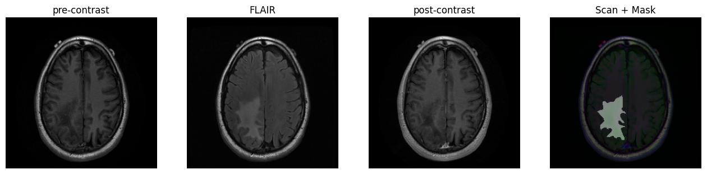

# LGG Brain Tumor Segmentation

## 1. Overview
This project focuses on binary segmenting brain tumors in MRI using a deep learning approach. The dataset consists of brain MR images and corresponding manual FLAIR abnormality segmentation masks from 110 patients with lower-grade gliomas. The model is based on a U-Net architecture with a MobileNet_v2 backbone, optimized for efficient segmentation performance.

| Patient - 7881                                    | Patient - 4941                                       | Patient - A5TW                                       | Patient - A61B                                      |
|---------------------------------------------------|------------------------------------------------------|------------------------------------------------------|-----------------------------------------------------|
|  |  |  |  |

## 2. Proposed Method
The segmentation model employs a U-Net architecture with a MobileNet_v2 backbone pretrained on ImageNet. The loss function combines Binary Cross-Entropy (BCE) Loss and Dice Loss to optimize segmentation accuracy, with the Dice Score as the primary evaluation metric.

## 3. Implementation

### 3.1. Dataset
The dataset includes:
- 110 folders named after case IDs containing MR images in `.tif` format.
- Each image has 3 channels: Pre-Contrast, FLAIR, and Post-Contrast.
- Masks are binary, 1-channel images indicating the presence of FLAIR abnormalities.

### 3.2. Model
- Architecture: U-Net
- Backbone: MobileNet_v2 (6,628,945 million parameters)
- Loss Function: ((0.5 * BCE Loss) + (0.5 * Dice Loss))
- Metric: Dice Score

### 3.3. Optimizer
| Hyperparameter                | Value           |
|-------------------------------|-----------------|
| Optimizer                     | Adam            |
| Initial Learning Rate         | 0.001           |
| Weight Decay                  | 0.0001          |
| Learning Rate Schedule        | MultiStepLR     |
| Learning Rate Decrease Epochs | 4th, 10th       |

### 3.3. Configuration
| Parameter                     | Value                                                                               |
|-------------------------------|-------------------------------------------------------------------------------------|
| Train/ Evaluation /Test Split | 80% / 10% / 10%                                                                     |
| Image Format                  | 3-Channel.tif                                                                       |
| Mask Format                   | Binary .tif                                                                         |
| Transformations               | Resize, RandomPhotometricDistort, RandomHorizontalFlip, RandomRotation, ColorJitter |
| GPU                           | Google Colab (T4)                                                                   |

## 4. Results

### 4.1. Results
| Metric      | Train Set | Evaluation Set | Test Set |
|-------------|-----------|----------------|----------|
| Loss        | 0.017     | 0.0302         | 0.025    |
| Dice Score  | 0.771     | 0.7006         | 0.8004   |

### 4.2. Learning and Metric Curves

## 5. Requirements
| Requirement                 | Version     |
|-----------------------------|-------------|
| Python                      | 3.12        |
| Pytorch                     | 2.6.0+cu124 |
| torchvision                 | 0.21.0+cu124 |
| torchmetrics                | 1.2         |
| segmentation_models_pytorch | 0.5.0       |

## 6. Contact
For questions or further information, please contact:
- Name: Yasin Gourkani
- Email: Yassingourkani@outlook.com 

Feel free to reach out for collaboration or inquiries regarding this project!